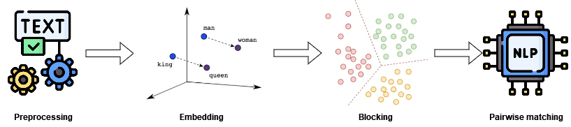

# linkage-project


## 🔎 About
### ⚡ Our approach on record linkage
Our approach consist in solving the problem of record linkage using **deep learning techniques** and **Large Language Models** (LLMs). 

The methodology can be summarized into four main activities: **dataset preprocessing**, **embedding data** items into a vector space, clustering for the **blocking** step and **pairwise matching** to find related entities.
This combination aims to address the inherent challenges of record linkage, particularly its scalability and accuracy.

The preprocessing stage is crucial in identifying the most representative features of each data item in the dataset. Effective preprocessing and data cleaning are fundamental to achieving good results when employing machine learning models. In our case, preprocessing focuses on extracting and refining the information that best represents each data item. 
This step ensures that the subsequent embedding and clustering processes work with clean, relevant data, thereby improving the overall performance of the record linkage system. 

Once the dataset is preprocessed, the next step involves using an embedding model to map data items into a vector space. The goal here is to represent similar objects as similar vectors. This step is critical because it transforms the data into a format suitable for machine learning models to process and analyze. By using a language model for embedding, we can capture the semantic similarities between data items, which is essential for accurately identifying potential matches. 

Clustering is used to implement the blocking step, which is essential for the scalability of the proposed system. Record linkage, in its worst-case scenario, involves an exponential complexity due to the need to compare all possible pairs of records. Blocking mitigates this by grouping similar data items into clusters, thereby reducing the number of comparisons needed. The effectiveness of the blocking step hinges on ensuring that similar data items, which are candidates for being the same real-world entity, end up in the same cluster. 

The final step is pairwise matching, where we compare pairs of records within each block to verify if they represent
the same entity. This stage leverages LLMs to perform the comparisons, using the context provided by the discriminant field used for embedding (e.g., page titles). Initially, most of the information in the discriminant field is reduced during preprocessing to standardize
the data. However, when using an LLM for pairwise matching, having more contextual information is beneficial. Therefore, we retain the raw discriminant field data before pre-processing to provide the LLM with richer context during matching. 



### 📒 DI2KG Dataset
The dataset used is the Monitor Specifications from the challenge [DI2KG](http://di2kg.inf.uniroma3.it/datasets.html). It has 26 sources with 16662 products, it exhibits high degree of heterogeneity both across and within sources.
This dataset consist of a set of products specifications in JSON format, automatically extracted from multiple e-commerce websites.
Each specification has been extracted from a web page and refers to a real-world product. A specification consists of a list of pairs and is stored in a file. Files are organized into directories, each directory corresponds to a web source. 

### 🛠️ Technologies
For the emmedding we used **DistilBERT**, that offers a significant reduction in size and computational overhead
while retaining a substantial portion of BERT’s performance capabilities.

For the blocking we used different clustering algorithms, that can be found in [scikit-learn clustering](https://scikit-learn.org/stable/api/sklearn.cluster.html):
- **Agglomerative**
- **DBSCAN**
- **HDBSCAN**
- **K-means**

In the pairwise matching step we used **LLAMA3 70B** and **ChatGPT-4o**.


## ⬇️ Setup
To execute the project you need the necessary libraries, in the following step we install the libraries using virtualenv but you can use a different environment.

If you don't have the virtualenv installed:
```
pip install virtualenv
```
Create the virtual environment with:
```
virtualenv .venv
```
Then activate the virtual environment, execute:
```
. .venv/bin/activate
```
Or (on windows):
```
.venv/Scripts/activate.bat
```
Finally get the libraries with:
```
pip install -r requirements.txt
```
(remove comments in the file requirements.txt if you have a Windows machine)
